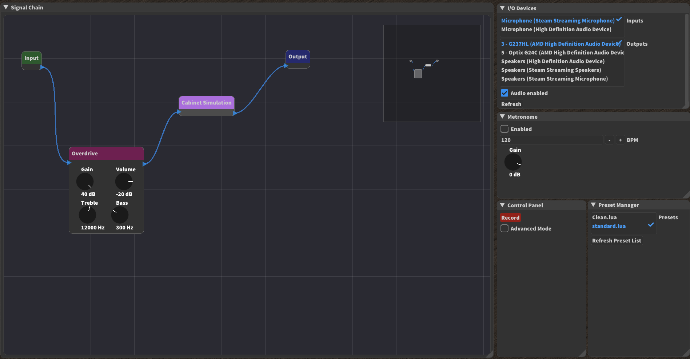

# Guitar Amp

[](https://travis-ci.com/nsdrozario/guitar-amp)

Real-time guitar amplifier simulation.



*WARNING: In this project's current state, there is no guarantee that the audio levels generated from this application are safe, neither for humans nor audio equipment. Use at your own risk.*

## Features

- [x] Distortion/Overdrive
  - [x] Min/max clipping
  - [x] tanh(x) clipping
  - [x] sin(x) clipping 
- [x] Convolution Reverb
  - Note: Impulse responses not included.
- [x] Compressor
  - [x] Peak activation
  - [ ] RMS activation
  - [ ] Adjustable attack
  - [ ] Adjustable release
  - [x] Adjustable ratio
  - [x] Adjustable threshold (in dB)    
## Dependencies

- [Dear ImGui](https://github.com/ocornut/imgui) (contained within this repository already)
- [Imgui-SFML](https://github.com/eliasdaler/imgui-sfml) (contained within this repository already)
- [imnodes](https://github.com/Nelarius/imnodes) (contained within this repository already)
- [implot](https://github.com/epezent/implot) (contained within this repository already)
- [Miniaudio](https://github.com/mackron/miniaudio) (contained within this repository already)
- [FFTConvolver](https://github.com/HiFi-LoFi/FFTConvolver) (contained within this repository already)
- [SFML (2.5)](https://github.com/SFML/SFML)

SFML 2.5 can be installed using Homebrew on Mac and `pacman` on MSYS2, but depending on your Linux distribution you may need to compile it from source.

## Building

## Linux

```bash
make -f Makefile_LINUX clean
make -f Makefile_LINUX -j
```

## Windows (MSYS2)

```bash
make -f Makefile_LINUX clean
make -f Makefile_WINDOWS -j
```

## Mac

```bash
make -f Makefile_LINUX clean
make -f Makefile_MAC -j
```


